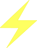

import Icon from '../../components/Icon.astro';
import Card from '../../components/Card.astro';
import TitleCard from '../../components/TitleCard.astro';
import CardGrid from '../../components/CardGrid.astro';

<TitleCard title="We bring the" showLogo={true} trailingLogo={true}/>

### We have spent years developing the most sophisticated and innovative AI-powered tools on the blockchain – all built on the NΞXUS AI Engine. From a fully automated premier AI Trading Platform buying capabilities to optimized Cross-Chain Swaps and the ability to analyze any smart contract at any time using artificial intelligence.

### The only thing more beautiful than maximizing crypto returns through groundbreaking tools is doing all of this 'together.' The members of THND are not 'consumers of a product' or even 'members of a community' – THND is a Crypto Club that moves and wins together.

### We never stop innovating, and we never stop building. We look forward to building the future of financial sovereignty and am thrilled to be doing so with such incredible people at THND.

 
<TitleCard title="The most elite Club in Crypto"/>

#### There is a difference between a 'community' and a 'Club' – and we embrace 'winning together' in a way no standard community does.

#### That's why we have partnered with the most 'technically perfect' art and PFP in Web3 and provide access to THND to the Azuki Ape community.

#### It is important to show your allegiance to your tribe, and through this partnership, every member can share the THND story with their followers and friends.

 
<TitleCard title="Utility" showLogo={true}/>

### Trailblazing blockchain solutions- our years of development yield advanced AI-powered tools on the NΞXUS AI Engine is built on the $THND token.

<CardGrid>
  <Card title="$THND" icon="lightning">
    There is no match for $THND's value and utility.
     
    It symbolizes our vision and grants access to our AI-powered crypto tools.
     
    Unlike 'pump and dump,' $THND defies norms. We opened at $28 on November 3, 2023,
    and hit an all-time-high (ATH) above $30k.
     
    <Card>
    $THND's journey is just beginning.
    </Card>
  </Card>
  <Card title="NΞXUS AI" icon="rocket">
    NEXUS AI is your AI-powered co-pilot for exciting, 
    yet sometimes overwhelming, world of crypto trading.
     
    Pioneered by a seasoned team, THND AI brings expertise, transparency, 
    and community to the forefront of your crypto journey.

    - **Automated Profits**
    - **Smarter Fees**
    - **Community Focus**
    - **Shared Success**
  </Card>
</CardGrid>

## Imagine it 🤖

- #### Automated Profits:
  - #### Our eagerly anticipated Autotrade feature takes the reins, making intelligent trading decisions based on real-time market data. Sit back and watch your portfolio grow with positive average user gains since launch.
- #### Smarter Fees:
  - #### Forget sky-high transaction costs! THND AI's sophisticated gas optimization and routing techniques save you up to 40% compared to leading competitors. More gains, less fees - that's the THND way.
- #### Community Focus:
  - #### We believe in open communication and collaboration. Join our vibrant Telegram community, engage with the team, share your thoughts, and learn from other traders. Your voice matters at THND.
- #### Shared Success:
  - #### Skin in the game? All Net revenue goes directly back to our users, proportional to your holdings. The more you hold, the more you earn. It's a win-win for everyone.

 

## THND AI is more than just a platform, it's a philosophy

- #### Expertise:
  - #### Decades of experience in AI and trading fuel our cutting-edge technology.
- #### Transparency:
  - #### We keep our doors open and our communication clear. Ask us anything!
- #### Community:
  - #### Your success is our success. We thrive on collaboration and shared knowledge.
- #### Profit:
  - #### We believe everyone deserves a piece of the pie. Our revenue-sharing model empowers you.

 

## Ready to take your crypto trading to the next level?

### Join THND today and experience the future of automated, profitable, and community-driven trading. 

### All funds are controlled by the user. THND is NOT an investment and is a license to access an advanced trading platform.

   

